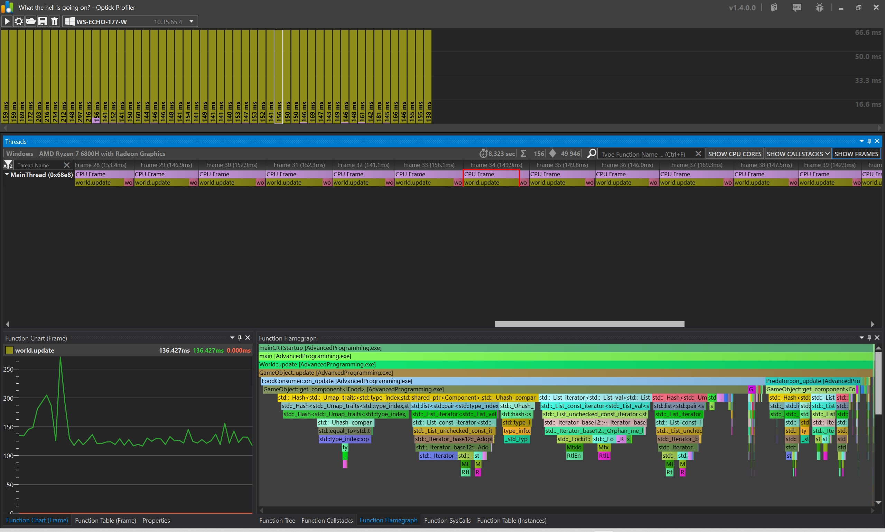

# How To Build

Download SDL3-devel-3.2.22-VC.zip
here https://github.com/libsdl-org/SDL/releases

Unpack into C:\libs
Rename SDL3-3.2.22 to SDL3
Copy "C:\libs\SDL3\lib\x64\SDL3.dll" to AdvancedProgramming/PATH_TO_EXE for Debug and RelWithDebInfo(just a Release below in the text)

Run:
cmake -S . -B build -DSDL3_DIR=\"C:/libs/SDL3/cmake\" && cmake --build build --config Debug
Or
cmake -S . -B build -DSDL3_DIR=\"C:/libs/SDL3/cmake\" && cmake --build build --config RelWithDebInfo

# Tasks

## 0. Setup environment and build

Build the builds and run them successfully.

## 1. Profile it!

Profile Debug and Release builds and save it.



## 2. Data oriented design refactor

Need to refactor every OOP style code like this:
```
auto newCell = world.create_object();
newCell->add_component<Sprite>(tileset.get_tile(spriteName));
newCell->add_component<Transform2D>(j, i);
newCell->add_component<BackGroundTag>();
```

With data oriented design SoA approach like that:
```
struct Tiles
{
    std::vector<Sprite> sprite;
    std::vector<Transform2D> transform;
    // no need to add BackGroundTag, because we don't need it in SoA approach
}
```

After successful refactor attach profiles after.

